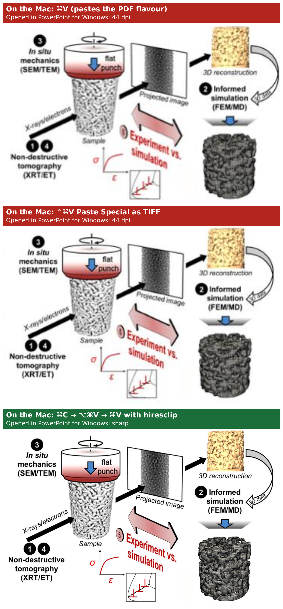

# hiresclip

Copy a figure out of a PDF in Preview, press one hotkey, paste a sharp bitmap into
PowerPoint. `hiresclip` reads the vector PDF that Preview puts on the macOS clipboard,
renders it at 600 dpi and puts the result back on the clipboard as a PNG. Office for Mac
then pastes the PNG instead of the blurry screen-resolution TIFF it would otherwise use,
and the slide still looks right when the deck is opened in PowerPoint on Windows.

Workflow: **select in Preview → ⌘C → ⌥⌘V → ⌘V in PowerPoint**



*The same journal figure, pasted three times into one deck on a Mac and then opened in
PowerPoint for Windows, shown at the zoom level of a projected slide. Top: plain ⌘V, which
hands PowerPoint the PDF flavour; on Windows it is a 44 dpi picture. Middle: ⌃⌘V Paste
Special as TIFF, also 44 dpi. Bottom: after pressing the hiresclip hotkey. The source is
Fig. 1 of [doi:10.1038/s43246-025-00914-z](https://doi.org/10.1038/s43246-025-00914-z)
(CC BY 4.0). The deck itself is [docs/copy-paste-probs.pptx](docs/copy-paste-probs.pptx),
so you can inspect the three pasted pictures on your own machine; the slides as exported
from PowerPoint for Windows are in [docs/copy-paste-probs.pdf](docs/copy-paste-probs.pdf).*

## The problem

When you drag a rectangle around part of a page in Preview (or Acrobat) and press ⌘C,
the clipboard holds the selection in two flavours at once: the vector PDF
(`com.adobe.pdf`) and a TIFF rendered at screen resolution, typically 72 or 144 dpi.
Which one you get on paste depends on the receiving application. Microsoft PowerPoint,
Word and Excel for Mac take the TIFF, so the pasted figure is blurry as soon as it is
scaled up or printed. The Apple Community thread
[Blurry content when copied from pdf file](https://discussions.apple.com/thread/253299890)
describes exactly this pair of flavours and ends without a fix beyond taking screenshots.
David Gleich's post
[Fuzzy & pixelated PDF copy & paste from macOS Preview](https://dgleich.wordpress.com/2017/01/16/fuzzy-pixelated-pdf-copy-paste-from-macos-preview/)
shows how to inspect the flavours on the pasteboard and confirms that a sharp paste needs
the `com.adobe.pdf` flavour to be present (in his case another app had hijacked that
type).

The obvious alternative, inserting or dragging the PDF itself, works on the Mac because
macOS treats PDF as a picture format. PowerPoint for Mac converts an inserted PDF to EMF
or PNG when it stores it in the file and you cannot choose which
([Microsoft Q&A](https://learn.microsoft.com/en-us/answers/questions/5408720/why-do-images-in-ppt-for-mac-come-through-blurry-i)).
Windows has no system-level PDF support, so PowerPoint for Windows can only show a PDF
as an object icon or a screenshot
([Microsoft Q&A](https://learn.microsoft.com/en-us/answers/questions/5140093/inserting-pdfs-into-ppts-(windows-vs-mac))),
and PDFs dragged into a deck on a Mac turn into PDF icons when the same deck is opened
on Windows
([Microsoft Q&A](https://learn.microsoft.com/en-us/answers/questions/5071901/insert-a-pdf-image-into-powerpoint)).
Users who build decks on a Mac and present them from Windows report figures that are
crisp on the Mac and blurry on Windows, with plain bitmaps being the format that
survives the round trip
([Microsoft Q&A](https://learn.microsoft.com/en-ca/answers/questions/5400715/powerpoint-blurry-images-after-saving-on-mac-and-o)).

So the safe thing to hand Office is a high-resolution bitmap. Making one by hand for
every figure (export, crop, insert) is what `hiresclip` replaces with a keystroke.

## How it works

The script asks the general pasteboard for its `com.adobe.pdf` data, rasterises the first
page with [pypdfium2](https://github.com/pypdfium2-team/pypdfium2) at the requested dpi
onto a transparent background and writes the PNG back as the only item on the clipboard.
Transparency is the default because most figures copied from papers have no background
of their own, so the pasted picture sits directly on the slide, whatever its colour;
`--white` gives an opaque white background instead. If `pdftocairo` from poppler
is available it also saves the PDF snippet and an SVG conversion to
`~/Desktop/hiresclip/` for people who prefer Insert → Picture from File. A macOS
notification reports the pixel size of the PNG, or tells you that there was no PDF on the
clipboard.

## Installation

Requirements: macOS and a conda installation
([Miniforge](https://github.com/conda-forge/miniforge) is enough). Homebrew is not needed,
and nothing is installed into the system Python.

### 1. Clone

```sh
git clone https://github.com/biterik/hiresclip.git
cd hiresclip
```

### 2. Run the installer

```sh
./install.sh
```

This creates the conda environment `hiresclip` from `environment.yml`
(python, pypdfium2, pillow, pyobjc-framework-cocoa, poppler), copies the script to
`~/bin/hiresclip.py`, runs a self-check and prints the command line for the next step.
It looks like this, with your real paths:

```
/Users/you/miniforge3/envs/hiresclip/bin/python /Users/you/bin/hiresclip.py
```

The absolute interpreter path matters: Shortcuts runs scripts without your shell
environment, so `conda activate` would not work there.

### 3. Create the hotkey in Shortcuts

1. Open **Shortcuts** and create a new shortcut (File → New Shortcut).
2. Add the action **Run Shell Script**. Set **Shell** to `zsh`, **Input** to `None`,
   and leave **Pass Input** at `to stdin`. Replace the script body with the command
   line printed by `install.sh`.
3. Open the shortcut details with the ⓘ button in the right-hand panel.
4. Tick **Use as Quick Action**.
5. Click the text that reads **Apps and N more** (the accepted input types) and untick
   every input type, so the Quick Action takes no input. Set
   **If there's no input** to **Continue**.
6. Click **Add Keyboard Shortcut** and press ⌥⌘V. This combination is not used by
   Preview, Acrobat or PowerPoint (macOS only binds it in Finder and in Apple's text
   apps, where it means "Paste Style"). Do not use ⌃⌘V: that is Paste Special in
   PowerPoint for Mac, the dialog that pastes the TIFF, and ⇧⌘V and ⌥⇧⌘V are
   PowerPoint's paste-formatting shortcuts. If ⌥⌘V is taken on your machine, ⌃⌥⌘V is
   free everywhere.
7. Give the shortcut the name `hiresclip`.

The first time the hotkey fires, macOS asks whether Shortcuts may run shell scripts and
may ask for access to the folder on the Desktop. Allow both. If you do not want a
hotkey, tick **Pin in Menu Bar** in the same panel instead and run it from the
menu bar.

To verify the setup without PowerPoint: copy a region in Preview, press the hotkey, and
paste into Preview with File → New from Clipboard. The window title shows the pixel size.

## Usage

Select a region in Preview or Acrobat, press ⌘C, press the hotkey (⌥⌘V), wait for the
notification, then ⌘V in PowerPoint, Word or Excel.

The script can also be run from a terminal, which is the easiest way to try options
before putting them into the shortcut:

```sh
~/miniforge3/envs/hiresclip/bin/python ~/bin/hiresclip.py --dpi 300
~/miniforge3/envs/hiresclip/bin/python ~/bin/hiresclip.py --white
~/miniforge3/envs/hiresclip/bin/python ~/bin/hiresclip.py --no-svg
~/miniforge3/envs/hiresclip/bin/python ~/bin/hiresclip.py --svg-dir ~/figures
~/miniforge3/envs/hiresclip/bin/python ~/bin/hiresclip.py --check
```

| Option | Meaning |
|---|---|
| `--dpi N` | Render resolution. Default 600, or the value of `HIRESCLIP_DPI` (`PDFCLIP_DPI` is also read). 300 is plenty for slides and keeps files small. |
| `--white` | Render onto an opaque white background. The default is a transparent background (RGBA PNG), which PowerPoint preserves, so the figure sits directly on the slide. Use `--white` for figures whose PDF relies on the page being white, or for pasting into applications that ignore transparency. |
| `--no-svg` | Do not write the PDF and SVG side files. |
| `--svg-dir DIR` | Where to write them. Default `~/Desktop/hiresclip`. |
| `--check` | Report interpreter, imports and the `pdftocairo` path. Does not touch the clipboard. |

Side output: for every conversion a `YYYYMMDD_HHMMSS.pdf` and, if `pdftocairo` was
found, a matching `.svg` are written to the SVG directory. Nothing in that folder is
cleaned up automatically. If the copied selection spans several pages, only the first
page is rendered and the notification says so.

The notification is sent with `osascript`, so macOS attributes it to **Script Editor**
in Notification Centre. If nothing appears, check that notifications for Script Editor
are allowed in System Settings → Notifications.

## Troubleshooting

**"No PDF on clipboard"**. The clipboard has no `com.adobe.pdf` flavour. This happens
when you copy from a browser's PDF viewer or from an image, which only puts a bitmap on
the clipboard. Open the file in Preview or Acrobat and copy from there. A selection made
with the text tool rather than the rectangular selection tool also does not produce a
PDF flavour.

**"The hiresclip service could not be used"**. Shortcuts refuses to run the Quick Action
because it expects input that is not there, or another app owns the hotkey. Open the
shortcut's ⓘ panel, make sure every input type under "Apps and N more" is unticked and
"If there's no input" is set to Continue, then try a different key combination.

**The hotkey does nothing**. Run the command line from `install.sh` in a terminal and
read the error. The usual cause is a moved or renamed conda environment; rerun
`./install.sh` to recreate it and print the new path. Remember that Shortcuts does not
load your shell profile, so `conda activate`, aliases and `$PATH` additions are not
available inside the Run Shell Script action. Use the absolute interpreter path.

**Notification appears, paste is still blurry**. Paste with plain ⌘V, not Paste Special.
Also check that PowerPoint is not compressing pictures on save (File → Compress
Pictures and the image quality setting in PowerPoint's preferences).

## Limitations

- macOS only. The clipboard access uses AppKit through PyObjC.
- The clipboard gets a PNG, not an SVG, because PowerPoint for Mac does not accept SVG
  from the clipboard. The SVG side file can be inserted with Insert → Picture from File.
- The background is transparent by default. A figure that only looks right on white
  (thin light-coloured lines, for instance) may need `--white` on a dark slide.
- Only the first page of a multi-page selection is rendered.
- Tested on macOS Tahoe with PowerPoint for Mac 365. The clipboard path is not covered by
  the unit tests, see "Development".

## Prior art and related work

I looked for an existing tool before writing this one and did another pass on GitHub and
PyPI while packaging it. I did not find one that renders the clipboard's PDF flavour to
a high-dpi bitmap for Office. The closest:

- [David Gleich, "Fuzzy & pixelated PDF copy & paste from macOS Preview" (2017)](https://dgleich.wordpress.com/2017/01/16/fuzzy-pixelated-pdf-copy-paste-from-macos-preview/)
  diagnoses the pasteboard flavours and shows that a sharp paste depends on the
  `com.adobe.pdf` flavour being present. No converter; the fix there was to remove an app
  that had taken over the PDF type.
- [myByways, "AppleScript to change clipboard image format"](https://mybyways.com/blog/applescript-to-change-clipboard-image-format)
  swaps the TIFF on the clipboard for a PNG or JPEG so that Office pastes that format.
  It converts the existing bitmap and does not render the PDF flavour, so the resolution
  stays what Preview produced.
- [RayPS, clipboard PNG to JPG gist](https://gist.github.com/RayPS/5f8c31de2a4ded2f0e947996c30ab1fe)
  does the same TIFF/PNG to JPEG swap in Python. It does not touch the PDF flavour.
- [RunnyC/clipboard-image-saver](https://github.com/RunnyC/clipboard-image-saver)
  is a Swift command-line tool that saves clipboard images, including PDF pages, as PNG
  files on disk. It writes files rather than replacing the clipboard, and does not
  document a render resolution.
- [tobywf/pasteboard](https://github.com/tobywf/pasteboard) and
  [pasteboard2](https://pypi.org/project/pasteboard2/) are Python bindings for
  NSPasteboard that can read the PDF flavour. They are libraries, not converters.

`hiresclip` differs from all of these by rendering the vector flavour at a chosen dpi
and putting the result back on the clipboard, so the paste itself becomes sharp.

On the name: `pdfclip` was the working name but is taken by
[hamano/pdfclip](https://github.com/hamano/pdfclip), a PDF cropping tool, and
`crispclip` is a video editor. `hiresclip` was free on GitHub at the time of writing.

## Development

```sh
~/miniforge3/envs/hiresclip/bin/python -m unittest discover -s tests -v
```

The tests build a small PDF by hand and exercise `render_png` (size, dpi metadata,
pixel content, multi-page handling, error cases), the side-file writer and the
command-line parsing. They run anywhere pypdfium2 and Pillow are installed. The
pasteboard code is not tested automatically; it was tested by hand on macOS Tahoe with
PowerPoint for Mac 365.

## Acknowledgment

Funded by the Deutsche Forschungsgemeinschaft (DFG, German Research Foundation) under
the National Research Data Infrastructure – NFDI 38/1 – project number 460247524
(NFDI-MatWerk consortium).

## License

BSD 3-Clause, see [LICENSE](LICENSE). To cite, use [CITATION.cff](CITATION.cff).
